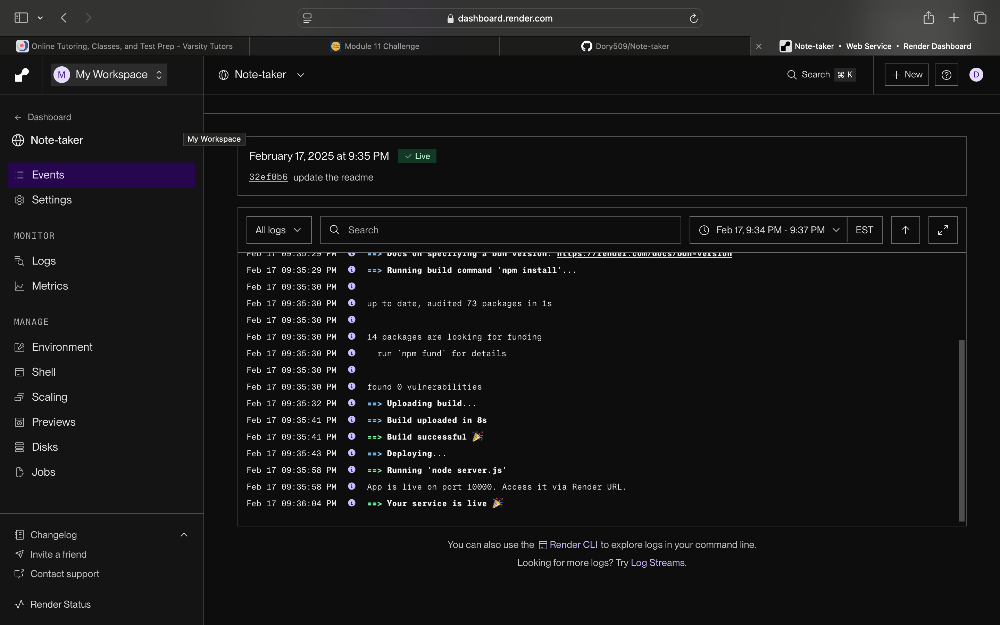

README.md for Note Taker App

Note Taker

 Description

The Note Taker is a simple web application that allows users to create, save, and delete notes using an Express.js backend. Notes are stored in a JSON file, providing persistent storage between sessions.

Table of Contents
	•	Description
	•	Installation
	•	Usage
	•	Features
	•	Technologies Used
	•	Demo
	•	License
	•	Contributing
	•	Questions

⚙️ Installation

 Clone the Repository

git clone https://github.com/Dory509/Note-taker.git
cd Note-Taker

Install Dependencies

Run the following command to install necessary packages:

npm install

Run the Application Locally

npm start

Then, open http://localhost:3001 in your browser.

 Usage
	1.	Click “Get Started” on the homepage.
	2.	Add a new note title and note text.
	3.	Click the save button  to store your note.
	4.	Click on an existing note to view it.
	5.	Click the delete button to remove a note.
	6.	Click the “New Note” button to create a new note.

Live Demo (Deployed on Render)
https://note-taker-2718.onrender.com
View the Live App Here

 Features

 Create new notes
 Save notes persistently
 View previously saved notes
 Delete notes
 User-friendly UI

 Technologies Used
	•	Node.js
	•	Express.js
	•	JavaScript
	•	HTML & CSS
	•	Bootstrap
	•	UUID (for unique note IDs)
	•	Render (for deployment)

📷 Demo Screenshot

 License

This project is licensed under the MIT License.

Contributing

Contributions are welcome! To contribute:
	1.	Fork the repository.
	2.	Create a new branch (feature-new-functionality).
	3.	Commit your changes (git commit -m "Added new feature").
	4.	Push to your branch (git push origin feature-new-functionality).
	5.	Open a Pull Request.

	screenshots:

 Questions

For questions or issues, contact me:
	•	GitHub: Dory509
	

